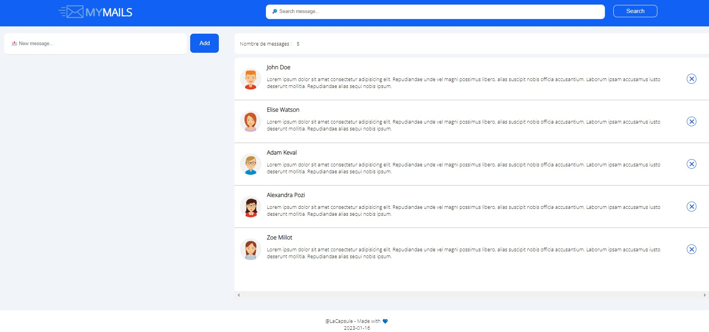
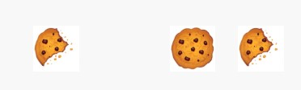
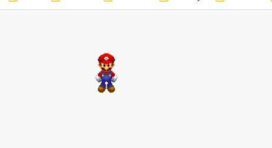
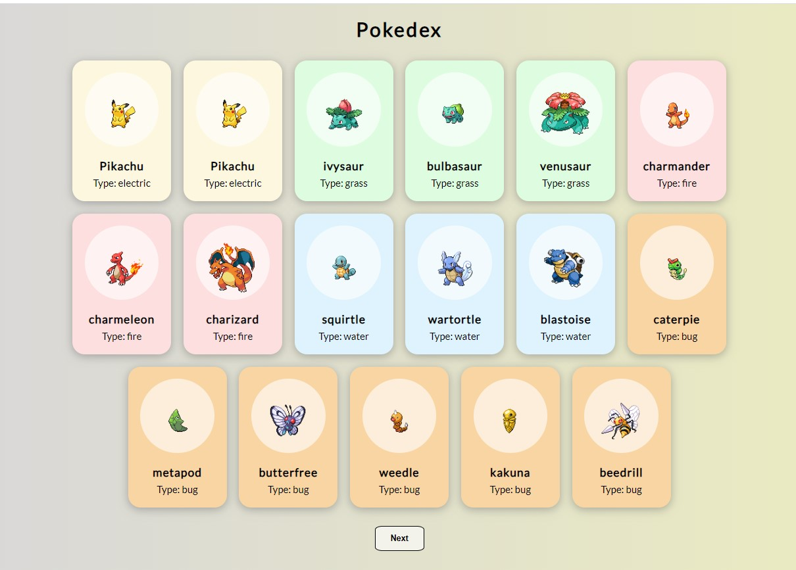
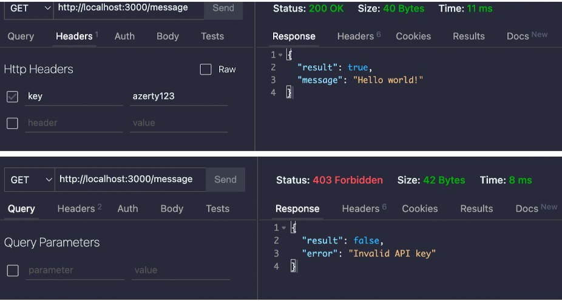
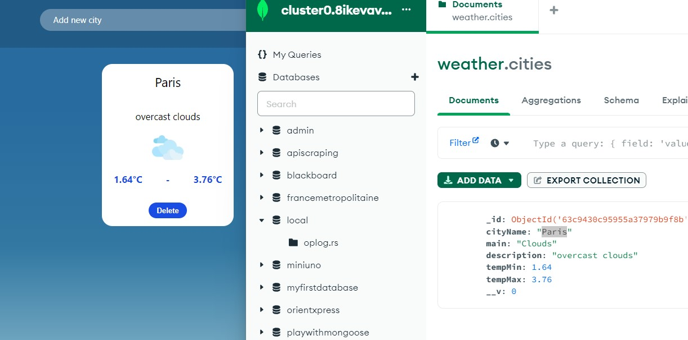

# La-Capsule-Fullstack-Bootcamp
Solutions of the exercises passed during the Webdev fullstack training in La Capsule

===
**10-JAN-2023 -----> EVENTS**
1. Capture an evenet:
There are five bullets on the web page listing ingredients of a recepts (created with 'li' elements).
The task is to add an event listener on the element with id = 2 and change its text on mouse click.

2. Change the text of a particular element when mouse hovered over it.
Same list from exercise 1.
The task is to add an event listener to all of them that listens for 'mouseover' event and
converts the text into "DONE" when mouse if hovered over a bullet.

3. My mail
This task is based on simple mail site created during html/css training day. Now, we must add 
functionalities:
a) Create a new message by adding text in the field 'New message' and pressing the 'Add' button
b) Suppress an existing message by pressing the 'cross' button at the right side of the message
c) Filter the messages by author's name - introduce the name of the authori in the 'Search message' field and press the 'Search' button.

4. Identical or not:
An array contains elements which, themselves, are arrays of different types.
A function must be created that will receive this array as parameter and for each array element inside that array 
must check if the elements inside are identical or not. If identical - value 'true' must be added to an output array,
if not identical - value 'false' must be added. The expected result is provided in the condition of the task.

5. Cookies
Four cookies are displayed on the screen. If we press on a cookie, its image must be replaced by the image of a bitten cookie. Pressed once again - it should be removed from the screen.
;

6. Super Mario DOM
The task is to move Mario figure on the screen using the arrow keys.
There are 4 images of Mario for the 4 directions and they must match
the direction of the movement. 
The solution uses 'keydown' event, offsetLeft and offsetTop to take the player's current
position and then - player.style.top and player.style.left to set the vertical and the horizontal
positions of the player.
 

===
**11-JAN-2023 -----> WEB SERVICES**
1. Discover [JSONPlaceholder](https://jsonplaceholder.typicode.com/) service. Study documentation
and create a script that fetches user with Id = 5. Then feed the name, the email and the 
phone details to the DOM.

2. Discover the web service [PokeAPI](https://pokeapi.co/). A pre-styled web page is available that
initkally contains one pokemon card. Two tasks:
 - at the inital load of the web page, the first 15 pokemons must be retrieved by the web service and 
 visualized in the dom.
 - when pressing the 'Next' button, the next 15 pokemons must be retrieved and visualized.
 

 ===
**12-JAN-2023 -----> MONGODB & MONGOOSE**
1. Play with Mongo DB via Atlas & Compass

===
**17-JAN-2023 -----> EXPRESS FRAMEWORK**   

1. Orient Express
The challenge is to create webservice in javascript. An array containing trip objects is pre-defined.
I have to define web routes to retrieve and manage the data in this array:
POST /trips : add a new trip
GET /trips : retrieve all the trips
GET /lastTrip : retrieve the last trip in the array
DELETE /trips : delete all the trips

All web route functions manipulate the array defined in the beginning of the script. There is no communication with a DB.

2. Weather App - Part 1
The task is to create a webservice that manages weather data. The data are presented in an array of objects with fields about
the location, the temperatures, weather description.
It should support GET for all locations and per location, POST data for new location, DELETE location data,
with verification if location query is valid or not.

3. Score Calculator
The correct answers of a test are stored in array 'res' and the aswers given by
a candidate passing the test are stored in array 'ans'. An algorythm must compare the
provided answers with the correct ones, calculate the score and determine whether
test was successfully past.

4. Express Middleware
The app.js contains an array with two possible API keys. The task is to create
a middleware in app.js file that verifies the key provided in the headers and
either confirm or deny access. The result must be as indicated in the pic.

===
**18-JAN-2023 -----> THIRD PARTY SERVICES**   
1. Orient Express 2
It is continuation of the Orient Express challenge from 17-Jan. A Mongo DB must be created containing the routes. The challenge now is to create a model for the trip and then modify the routes in the index.js file in order to maniputlate the database:
POST /trips : add a new trip to the DB
GET /trips : retrieve all the trips from the DB
GET /lastTrip : retrieve the last trip in the DB
DELETE /trips : delete all the trips from the DB

===
**19-JAN-2023 -----> MVC & MODULES ES5**
1. Clear Your Room challenge
Index.js located in the 'routes' folder contains routes for home, admin and moderator. The task is to reorganize the code
by creating 'admin.js' and 'moderator.js' files containing the routes for the two families and then customize the routes' prefixes
in app.js by exporting/importing technic. Then, a file 'checkPasswords.js' must be created containing two functions for checking
admin's and moderator's passwords. These functions must be exported from 'checkPasswords.js' and then imported in the corresponding family's js file.  

2. Weather App - Part 3
This is continuation of the Weather App started on 17-Jan. The task is to apply the MVC approach by
creating backend and frontend folders, then customizing the families of routes with individual files per family,
create models for weather database and db connection functionality and finally workout the backend routes to 
communicate with the db.
Using the frontend functionality is then updating the Mongo db accordingly

3. Algorithm exercise:
Develop a function that is merging two arrays by removing duplicates and sorting the entries in alphabetical order.

4. Simulate [Wordle](https://www.nytimes.com/games/wordle/index.html) game.

===
**23-JAN-2023 -----> TDD (Test Driven Development) & Clean Code**
1. MyPharmacy challenge:
pharmacy.test.js script is provided containing test of three functions. The task is to develop these functions to match the requirement assumed in the test script (TDD approach is hence applied).

2. Play with dates: 4 exercises designated to use Date object and its basic methods.

3. Manage your stock: a challenge aiming to develop, using a TDD approach, from A to Z a backend for managing a stock of products.
The challenge provides file 'data.js' containing an array of product objects. Five routes then must be developped to return filtered
data depening on the route's parameter. These functions must then be covered by the tests.